# 🌐 Terraform AWS ECS Fargate Infrastructure with MongoDB Atlas Integration

[](https://terraform.io)
[](https://aws.amazon.com)
[](https://www.mongodb.com/atlas)
[](LICENSE)

A **production-ready, enterprise-grade** Terraform infrastructure solution for deploying containerized applications on **AWS ECS Fargate** with **MongoDB Atlas** integration, featuring automated CI/CD pipeline, SSL termination, and comprehensive security controls.

## 🚀 Key Features

### Core Infrastructure
- **🐳 ECS Fargate**: Serverless container orchestration with auto-scaling
- **🔄 Automated CI/CD**: ECR push → EventBridge → Lambda → ECS deployment
- **🌐 Load Balancing**: Application Load Balancer with health checks
- **🔐 SSL/TLS Termination**: Automated certificate management with AWS ACM
- **🏗️ Modular Architecture**: 10+ reusable Terraform modules

### Database & Networking
- **📊 MongoDB Atlas**: Managed database with VPC peering for private connectivity
- **🌐 Multi-AZ Deployment**: High availability across availability zones
- **🔒 Private Networking**: Applications run in private subnets with NAT Gateway
- **📋 DNS Management**: Route 53 integration with custom domains

### DevOps & Security
- **🔒 IAM Security**: Least privilege access with role-based permissions
- **📊 Monitoring**: CloudWatch logs and metrics for all components
- **🚀 Auto-Deploy**: Zero-downtime deployments with configurable strategies
- **🔧 Optional Components**: Configurable SSL and custom domain setup

## 🏗️ Architecture Overview

### High-Level Infrastructure Diagram

```mermaid
graph TB
    subgraph "Internet"
        User[👤 User]
        Developer[👨‍💻 Developer]
    end
    
    subgraph "AWS Public Subnet"
        ALB[🌐 Application Load Balancer]
        NAT[📡 NAT Gateway]
        IGW[🌍 Internet Gateway]
    end
    
    subgraph "AWS Private Subnet"
        ECS[🐳 ECS Fargate Tasks]
        Lambda[⚡ Auto-Deploy Lambda]
    end
    
    subgraph "AWS Services"
        ECR[📦 ECR Repository]
        EB[📡 EventBridge]
        CW[📊 CloudWatch Logs]
        IAM[🔑 IAM Roles]
    end
    
    subgraph "DNS & SSL"
        R53[🌍 Route 53]
        ACM[🔒 ACM Certificate]
    end
    
    subgraph "External Database"
        MongoDB[🍃 MongoDB Atlas<br/>VPC Peering]
    end
    
    %% User Flow
    User -->|HTTPS/HTTP| R53
    R53 -->|DNS Resolution| ALB
    ACM -->|SSL Certificate| ALB
    ALB -->|Load Balance| ECS
    
    %% Development Flow
    Developer -->|docker push| ECR
    ECR -->|Image Push Event| EB
    EB -->|Trigger| Lambda
    Lambda -->|Update Service| ECS
    
    %% Infrastructure
    ECS -->|Database Queries| MongoDB
    ECS -->|Internet Access| NAT
    NAT -->|External Access| IGW
    ECS -->|Logs| CW
    Lambda -->|Logs| CW
    IAM -->|Permissions| ECS
    IAM -->|Permissions| Lambda
    
    %% Styling
    classDef aws fill:#FF9900,stroke:#333,stroke-width:2px,color:#fff
    classDef external fill:#4CAF50,stroke:#333,stroke-width:2px,color:#fff
    classDef user fill:#2196F3,stroke:#333,stroke-width:2px,color:#fff
    
    class ALB,NAT,IGW,ECS,Lambda,ECR,EB,CW,IAM,R53,ACM aws
    class MongoDB external
    class User,Developer user
```



### Detailed Network Architecture


## 📂 Infrastructure Modules

| Module | Purpose | Resources | Features |
|--------|---------|-----------|----------|
| **🌐 VPC** | Network Foundation | VPC, Subnets, IGW, NAT | Multi-AZ, Public/Private subnets |
| **⚖️ ALB** | Load Balancing | ALB, Target Groups, Listeners | SSL termination, Health checks |
| **🐳 ECS** | Container Orchestration | Cluster, Service, Task Definition | Fargate, Auto-scaling |
| **📦 ECR** | Container Registry | Repository, Lifecycle policies | Image scanning, Encryption |
| **🔑 IAM** | Access Management | Roles, Policies | Least privilege, Service roles |
| **⚡ Lambda** | Auto-Deployment | Function, Log groups | Event-driven deployments |
| **📡 EventBridge** | Event Routing | Rules, Targets | ECR push event filtering |
| **🌍 Route53** | DNS Management | Hosted Zone, Records | Domain routing |
| **🔒 ACM** | SSL Certificates | Certificate, Validation | Automated renewal |
| **🍃 MongoDB** | Database | Atlas Project, Cluster, Users | VPC peering, IP whitelisting |

## 🎯 Auto-Deploy Pipeline

### CI/CD Pipeline Flow

```mermaid
sequenceDiagram
    participant Dev as 👨‍💻 Developer
    participant ECR as 📦 ECR Repository
    participant EB as 📡 EventBridge
    participant Lambda as ⚡ Lambda Function
    participant ECS as 🐳 ECS Service
    participant ALB as 🌐 Load Balancer
    participant User as 👤 User

    Note over Dev,User: Automated Deployment Pipeline

    Dev->>ECR: 1. docker push image:latest
    Note right of ECR: Image stored with<br/>automatic scanning
    
    ECR->>EB: 2. Push Success Event
    Note right of EB: Event: ECR Image Action<br/>Source: aws.ecr
    
    EB->>Lambda: 3. Trigger Deployment Function
    Note right of Lambda: deployment-strategy.py<br/>Strategy: FORCE/REGISTER
    
    Lambda->>ECS: 4. Update Service
    Note right of ECS: Force new deployment<br/>or register new task def
    
    ECS->>ECS: 5. Pull New Image
    Note right of ECS: Download from ECR<br/>Start new tasks
    
    ECS->>ALB: 6. Register New Tasks
    Note right of ALB: Health check<br/>Traffic shifting
    
    ECS->>ECS: 7. Stop Old Tasks
    Note right of ECS: Graceful shutdown<br/>Zero downtime
    
    ALB->>User: 8. Serve New Version
    Note right of User: Updated application<br/>accessible immediately

    Note over Dev,User: ✅ Deployment Complete (30-60 seconds)
```



### Deployment Strategies Comparison

```mermaid
graph TB
    subgraph "FORCE Strategy"
        F1[New Image Pushed]
        F2[Lambda Triggered]
        F3[ECS Force New Deployment]
        F4[Same Task Definition]
        F5[Pull Latest Image]
        F6[✅ Fast Deployment]
        
        F1 --> F2 --> F3 --> F4 --> F5 --> F6
    end
    
    subgraph "REGISTER Strategy"
        R1[New Image Pushed]
        R2[Lambda Triggered]
        R3[Create New Task Definition]
        R4[Update Service]
        R5[Pull Specific Image Tag]
        R6[✅ Version Control]
        
        R1 --> R2 --> R3 --> R4 --> R5 --> R6
    end
    
    classDef force fill:#FFE0B2,stroke:#F57C00,stroke-width:2px
    classDef register fill:#E8F5E8,stroke:#388E3C,stroke-width:2px
    
    class F1,F2,F3,F4,F5,F6 force
    class R1,R2,R3,R4,R5,R6 register
```



### Pipeline Configuration
- **FORCE**: Quick redeploy using existing task definition (recommended for development)
- **REGISTER**: Create new task definition with specific image tag (recommended for production)

## 🛠️ Quick Start

### Prerequisites
```bash
# Required tools
terraform >= 1.0
aws-cli >= 2.0
docker >= 20.0

# Required accounts
AWS Account with appropriate IAM permissions
MongoDB Atlas Account with API keys
```

### 1. Initial Setup
```bash
git clone https://github.com/BetoNajera9/terraform-fargate-mongodb.git
cd terraform-fargate-mongodb
```

### 2. Configure Variables
Create `terraform.tfvars`:
```hcl
# === AWS Configuration ===
aws_region = "us-east-1"

# === Network Configuration ===
vpc_vpc_cidr = "10.0.0.0/16"
vpc_public_subnets = {
  "us-east-1a" = "10.0.1.0/24"
  "us-east-1b" = "10.0.2.0/24"
}
vpc_private_subnet = {
  "us-east-1a" = "10.0.3.0/24"
  "us-east-1b" = "10.0.4.0/24"
}

# === Domain Configuration (Optional) ===
enable_custom_domain = true  # Set to false to disable SSL/domain setup
route53_domain_name = "yourdomain.com"
route53_subdomain_name = "app.yourdomain.com"
acm_subject_alternative_names = ["*.yourdomain.com"]

# === MongoDB Atlas Configuration ===
mongodbatlas_public_key = "your-atlas-public-key"
mongodbatlas_private_key = "your-atlas-private-key"
mongodb_database_username = "app_user"
mongodb_database_password = "secure_password"
mongodb_provider_name = "AWS"  # For M10+ clusters
mongodb_instance_size = "M10"  # M0=Free, M2/M5=Shared, M10+=Dedicated
mongodb_vpc_peering_enabled = true

# === Application Configuration ===
ecs_container_name = "my-app"
ecs_use_ecr = true
ecr_repository_name = "my-app-repo"
autodeploy_deployment_strategy = "FORCE"
```

### 3. Deploy Infrastructure
```bash
# Initialize Terraform
terraform init

# Review execution plan
terraform plan

# Deploy infrastructure
terraform apply
```

### 4. Deploy Application
```bash
# Get ECR login token
aws ecr get-login-password --region us-east-1 | docker login --username AWS --password-stdin <account-id>.dkr.ecr.us-east-1.amazonaws.com

# Build and push image
docker build -t my-app .
docker tag my-app:latest <account-id>.dkr.ecr.us-east-1.amazonaws.com/my-app-repo:latest
docker push <account-id>.dkr.ecr.us-east-1.amazonaws.com/my-app-repo:latest

# 🎉 Auto-deploy triggers automatically!
```

## ⚠️ Important Configuration Notes

### Custom Domain Setup
The ACM module **will fail** if your domain's nameservers are not properly configured:

#### Option 1: Configure nameservers first (Recommended)
1. **Before deployment**: Update your domain's nameservers to point to AWS Route53
2. **Check nameservers**: Verify DNS propagation using `dig NS yourdomain.com`
3. **Wait for propagation**: DNS changes can take up to 48 hours to propagate globally

#### Option 2: Deploy without waiting for validation
```hcl
enable_custom_domain = true
alb_ssl_wait_for_validation = false  # Skip validation wait
```
This creates the certificate but doesn't wait for validation. You can manually validate later in AWS Console.

#### Option 3: Skip SSL completely
```hcl
enable_custom_domain = false  # Skip SSL/domain setup entirely
```

### MongoDB Atlas Configuration

#### Instance Size Guidelines
- **M0**: Free tier, shared infrastructure, 512MB storage
- **M2/M5**: Shared infrastructure, limited to 1 node
- **M10+**: Dedicated infrastructure, supports replica sets (3+ nodes)

#### MongoDB Integration Flow

```mermaid
graph TB
    subgraph "AWS VPC 10.0.0.0/16"
        subgraph "Private Subnet"
            ECS[🐳 ECS Fargate Tasks<br/>App Containers]
        end
        RT[Route Table<br/>+ Atlas Routes]
    end
    
    subgraph "MongoDB Atlas VPC 192.168.248.0/21"
        subgraph "MongoDB Cluster"
            Primary[📊 Primary Node<br/>Read/Write]
            Secondary1[📊 Secondary Node<br/>Read Only]
            Secondary2[📊 Secondary Node<br/>Read Only]
        end
        NetworkContainer[🌐 Network Container<br/>Atlas VPC]
    end
    
    subgraph "MongoDB Configuration"
        Project[📋 Atlas Project]
        Users[👤 Database Users<br/>ReadWrite + dbAdmin]
        IPAccess[🔒 IP Access List<br/>VPC CIDR: 10.0.0.0/16]
    end
    
    %% VPC Peering
    ECS -.->|VPC Peering Connection<br/>Private Network| NetworkContainer
    NetworkContainer --> Primary
    NetworkContainer --> Secondary1
    NetworkContainer --> Secondary2
    
    %% Route Configuration
    RT -.->|192.168.248.0/21<br/>via Peering| NetworkContainer
    
    %% MongoDB Setup
    Project --> Users
    Project --> IPAccess
    Project --> NetworkContainer
    
    %% Environment Variables
    ECS -->|Environment Variables| EnvVars[🔧 MONGODB_URI<br/>MONGODB_DATABASE<br/>MONGODB_USERNAME]
    
    classDef aws fill:#FF9900,stroke:#333,stroke-width:2px,color:#fff
    classDef mongodb fill:#4CAF50,stroke:#333,stroke-width:2px,color:#fff
    classDef config fill:#9C27B0,stroke:#333,stroke-width:2px,color:#fff
    classDef connection stroke-dasharray: 5 5,stroke:#FF5722,stroke-width:3px
    
    class ECS,RT aws
    class Primary,Secondary1,Secondary2,NetworkContainer mongodb
    class Project,Users,IPAccess,EnvVars config
```



#### Provider Configuration
```hcl
# For dedicated clusters (M10+)
mongodb_provider_name = "AWS"
mongodb_backing_provider_name = null  # Auto-managed

# For shared clusters (M0/M2/M5)  
mongodb_provider_name = "TENANT"
mongodb_backing_provider_name = "AWS"
```

## 🔧 Configuration Options

### Environment Variables
The ECS tasks automatically include:
```bash
MONGODB_URI         # Full connection string
MONGODB_DATABASE    # Database name
MONGODB_USERNAME    # Database user
NODE_ENV=production
PORT=80            # Container port
```

### Scaling Configuration
```hcl
ecs_cpu = "512"           # CPU units (256-4096)
ecs_memory = "1024"       # Memory in MiB (512-30720)
ecs_desired_count = 2     # Number of running tasks
```

### Security Configuration
```hcl
mongodb_ip_access_list = [
  {
    ip_address = "10.0.0.0/16"  # VPC CIDR for security
    comment    = "VPC Access"
  }
]
```

## 🔒 Security Features

- **🏠 Network Isolation**: Private subnets with NAT Gateway
- **🛡️ Security Groups**: Restrictive ingress/egress rules
- **🔐 IAM Roles**: Least privilege access policies
- **🔒 SSL/TLS**: End-to-end encryption (when enabled)
- **📊 VPC Peering**: Private MongoDB connectivity
- **🔍 Monitoring**: CloudWatch logs for all components

## 📊 Monitoring & Logging

### Observability Architecture

```mermaid
graph TB
    subgraph "Application Layer"
        ECS[🐳 ECS Tasks]
        Lambda[⚡ Lambda Functions]
        ALB[⚖️ Application Load Balancer]
    end
    
    subgraph "AWS CloudWatch"
        subgraph "Log Groups"
            ECSLogs[📋 /ecs/service-name<br/>Application Logs]
            LambdaLogs[📋 /lambda/deployment-strategy<br/>Deployment Logs]
            ALBLogs[📋 ALB Access Logs<br/>Traffic Patterns]
        end
        
        subgraph "Metrics"
            ECSMetrics[📊 CPU, Memory, Network<br/>Task Health & Scaling]
            LambdaMetrics[📊 Duration, Errors<br/>Deployment Success Rate]
            ALBMetrics[📊 Request Count, Latency<br/>Response Times]
        end
        
        subgraph "Alarms"
            HealthAlarm[🚨 ECS Task Health]
            ErrorAlarm[🚨 High Error Rate]
            LatencyAlarm[🚨 High Latency]
        end
    end
    
    subgraph "External Monitoring"
        MongoDB[🍃 MongoDB Atlas Dashboard<br/>Database Performance]
        Route53Health[🌍 Route53 Health Checks<br/>DNS Monitoring]
    end
    
    %% Log Flow
    ECS --> ECSLogs
    Lambda --> LambdaLogs
    ALB --> ALBLogs
    
    %% Metrics Flow
    ECS --> ECSMetrics
    Lambda --> LambdaMetrics
    ALB --> ALBMetrics
    
    %% Alarms Flow
    ECSMetrics --> HealthAlarm
    ALBMetrics --> ErrorAlarm
    ALBMetrics --> LatencyAlarm
    
    %% External Monitoring
    ECS -.-> MongoDB
    ALB -.-> Route53Health
    
    classDef app fill:#FFF3E0,stroke:#F57C00,stroke-width:2px
    classDef logs fill:#E8F5E8,stroke:#388E3C,stroke-width:2px
    classDef metrics fill:#E3F2FD,stroke:#1976D2,stroke-width:2px
    classDef alarms fill:#FFEBEE,stroke:#D32F2F,stroke-width:2px
    classDef external fill:#F3E5F5,stroke:#7B1FA2,stroke-width:2px
    
    class ECS,Lambda,ALB app
    class ECSLogs,LambdaLogs,ALBLogs logs
    class ECSMetrics,LambdaMetrics,ALBMetrics metrics
    class HealthAlarm,ErrorAlarm,LatencyAlarm alarms
    class MongoDB,Route53Health external
```



All components include comprehensive observability:

| Component | Log Group | Metrics | Monitoring |
|-----------|-----------|---------|------------|
| **ECS Tasks** | `/ecs/{service-name}` | CPU, Memory, Network | Task health, scaling |
| **Lambda** | `/lambda/{function-name}` | Duration, Errors | Deployment success |
| **ALB** | Access logs | Request count, Latency | Traffic patterns |
| **MongoDB** | Atlas Dashboard | Connections, Performance | Database metrics |

## 🧪 Testing the Pipeline

### End-to-End Test
1. Make code changes to your application
2. Build new Docker image: `docker build -t myapp:v2 .`
3. Push to ECR: `docker push <ecr-url>:v2`
4. Monitor ECS service for automatic update
5. Verify deployment in application logs

### Manual Deployment
```bash
# Force deployment without new image
aws ecs update-service --cluster <cluster-name> --service <service-name> --force-new-deployment
```

## 🚨 Troubleshooting

### Common Issues

#### ACM Certificate Validation Failure
```bash
# Verify nameservers
dig NS yourdomain.com

# Check Route53 hosted zone
aws route53 list-hosted-zones
```

#### MongoDB Connection Issues
```bash
# Test VPC peering
aws ec2 describe-vpc-peering-connections

# Verify security groups
aws ec2 describe-security-groups --group-ids <sg-id>
```

#### ECS Task Startup Failures
```bash
# Check task logs
aws logs tail /ecs/<service-name> --follow

# Verify task definition
aws ecs describe-task-definition --task-definition <family>
```

## 🏗️ Module Structure & Dependencies


```
terraform-fargate-mongodb/
├── 📋 Root Configuration
│   ├── modules.tf          # Module orchestration & dependencies
│   ├── variables.tf        # Input parameters & validation
│   ├── providers.tf        # AWS & MongoDB Atlas providers
│   └── outputs.tf          # Important values post-deployment
│
├── 🧱 Infrastructure Modules
│   ├── vpc/                # 🌐 Virtual Private Cloud
│   │   ├── main.tf         # VPC, subnets, gateways, routing
│   │   ├── variables.tf    # Network configuration parameters
│   │   └── outputs.tf      # VPC IDs, subnet IDs, route tables
│   │
│   ├── alb/                # ⚖️ Application Load Balancer
│   │   ├── main.tf         # ALB, listeners, target groups, SSL
│   │   ├── variables.tf    # Load balancer & SSL configuration
│   │   └── outputs.tf      # ALB DNS, ARN, target group ARN
│   │
│   ├── ecs/                # 🐳 Elastic Container Service
│   │   ├── main.tf         # Cluster, service, task definition
│   │   ├── variables.tf    # Container & scaling configuration
│   │   └── outputs.tf      # Cluster ARN, service name
│   │
│   ├── ecr/                # 📦 Elastic Container Registry
│   │   ├── main.tf         # Repository, lifecycle, scanning
│   │   ├── variables.tf    # Registry policies & encryption
│   │   └── outputs.tf      # Repository URL & ARN
│   │
│   ├── iam/                # 🔑 Identity & Access Management
│   │   ├── main.tf         # Roles, policies, attachments
│   │   ├── variables.tf    # Role naming & permissions
│   │   └── outputs.tf      # Role ARNs for services
│   │
│   ├── lambda/             # ⚡ Lambda Functions
│   │   ├── main.tf         # Function, triggers, log groups
│   │   ├── variables.tf    # Function configuration
│   │   └── outputs.tf      # Function ARN & name
│   │
│   ├── eventbridge/        # 📡 EventBridge Rules
│   │   ├── main.tf         # Rules, targets, event patterns
│   │   ├── variables.tf    # Event filtering configuration
│   │   └── outputs.tf      # Rule ARNs
│   │
│   ├── route53/            # 🌍 DNS Management (Optional)
│   │   ├── main.tf         # Hosted zones, DNS records
│   │   ├── variables.tf    # Domain configuration
│   │   └── outputs.tf      # Zone IDs, nameservers
│   │
│   ├── acm/                # 🔒 SSL Certificate Management (Optional)
│   │   ├── main.tf         # Certificate, DNS validation
│   │   ├── variables.tf    # Certificate & validation config
│   │   └── outputs.tf      # Certificate ARN
│   │
│   └── mongodb/            # 🍃 MongoDB Atlas Integration
│       ├── main.tf         # Project, cluster, users, VPC peering
│       ├── variables.tf    # Database & network configuration
│       ├── outputs.tf      # Connection strings, cluster info
│       └── versions.tf     # MongoDB Atlas provider requirements
│
└── 🔧 Application Code
    └── lambda-functions/
        └── deployment-strategy.py  # Auto-deploy Lambda logic
```

## 🤝 Contributing

1. Fork the repository
2. Create feature branch: `git checkout -b feature/amazing-feature`
3. Commit changes: `git commit -m 'Add amazing feature'`
4. Push to branch: `git push origin feature/amazing-feature`
5. Open Pull Request

## 📜 License

This project is licensed under the MIT License - see the [LICENSE](LICENSE) file for details.

## 🆘 Support & Documentation

- 📧 **Issues**: [GitHub Issues](https://github.com/BetoNajera9/terraform-fargate-mongodb/issues)
- 📖 **Terraform Docs**: [HashiCorp Terraform](https://terraform.io/docs)
- 🏗️ **AWS Provider**: [Terraform AWS Provider](https://registry.terraform.io/providers/hashicorp/aws/latest/docs)
- 🍃 **MongoDB Atlas**: [MongoDB Atlas Provider](https://registry.terraform.io/providers/mongodb/mongodbatlas/latest/docs)

---

**Built with ❤️ by [BetoNajera9](https://github.com/BetoNajera9) using Terraform and AWS**

## 🎯 Auto-Deploy Pipeline

The infrastructure includes a **fully automated deployment pipeline**:

### How it works:
```
1️⃣  Developer pushes new Docker image to ECR
     ↓
2️⃣  EventBridge detects ECR "image push" event
     ↓
3️⃣  Lambda function is triggered automatically
     ↓
4️⃣  Lambda updates ECS service (force new deployment)
     ↓
5️⃣  ECS Fargate pulls new image and redeploys
     ↓
6️⃣  ✅ Application updated with zero downtime
```

### Deployment Strategies:
- **FORCE**: Quick redeploy using existing task definition
- **REGISTER**: Create new task definition with specific image tag

## 🛠️ Infrastructure Components

| Component | Purpose | Configuration |
|-----------|---------|---------------|
| **VPC** | Network isolation | Public/Private subnets across AZs |
| **ALB** | Load balancing | SSL termination, health checks |
| **ECS** | Container orchestration | Fargate serverless compute |
| **ECR** | Container registry | Lifecycle policies, encryption |
| **Lambda** | Auto-deployment | Python 3.11, EventBridge triggered |
| **EventBridge** | Event routing | ECR push event filtering |
| **Route53** | DNS management | Domain & subdomain routing |
| **ACM** | SSL certificates | Automated validation & renewal |
| **IAM** | Security | Least privilege access policies |
| **MongoDB Atlas** | NoSQL Database | Managed MongoDB with backup & scaling |

## 🚀 Quick Start

### Prerequisites
- AWS CLI configured with appropriate permissions
- Terraform >= 1.0
- Docker for container builds

### 1. Clone Repository
```bash
git clone https://github.com/BetoNajera9/terraform-fargate-mongodb.git
cd terraform-fargate-mongodb
```

### 2. Configure Variables
Create `terraform.tfvars`:
```hcl
# AWS Configuration
aws_region = "us-east-1"

# MongoDB Atlas (Optional)
mongodbatlas_public_key  = "your-atlas-public-key"
mongodbatlas_private_key = "your-atlas-private-key"

# Networking
vpc_vpc_cidr = "10.0.0.0/16"
vpc_public_subnets = {
  "us-east-1a" = "10.0.1.0/24"
  "us-east-1b" = "10.0.2.0/24"
}
vpc_private_subnet = {
  "us-east-1a" = "10.0.10.0/24"
  "us-east-1b" = "10.0.11.0/24"
}

# Domain Configuration
route53_domain_name    = "your-domain.com"
route53_subdomain_name = "app.your-domain.com"
acm_subject_alternative_names = ["*.your-domain.com"]

# Application Configuration
ecs_container_name  = "my-app"
ecs_use_ecr        = true
ecr_repository_name = "my-app-repo"

# Auto-Deploy Configuration
autodeploy_deployment_strategy = "FORCE"  # or "REGISTER"
```

### 3. Deploy Infrastructure
```bash
# Initialize Terraform
terraform init

# Review execution plan
terraform plan

# Deploy infrastructure
terraform apply
```

### 4. Deploy Your Application
```bash
# Build and push your Docker image
docker build -t my-app .
docker tag my-app:latest <account-id>.dkr.ecr.<region>.amazonaws.com/my-app-repo:latest
docker push <account-id>.dkr.ecr.<region>.amazonaws.com/my-app-repo:latest

# 🎉 Auto-deploy will trigger automatically within 30 seconds!
```

## 🔧 Configuration Options

### ECS Configuration
```hcl
ecs_cpu            = "512"     # CPU units (256, 512, 1024, etc.)
ecs_memory         = "1024"    # Memory in MiB
ecs_desired_count  = 1         # Number of running tasks
ecs_container_port = 80        # Port your app listens on
```

### Auto-Deploy Strategy
```hcl
# FORCE: Quick redeploy (recommended for development)
autodeploy_deployment_strategy = "FORCE"

# REGISTER: Create new task definition (recommended for production)
autodeploy_deployment_strategy = "REGISTER"
```

### Load Balancer Configuration
```hcl
alb_listener_port        = 443                    # HTTPS
alb_listener_protocol    = "HTTPS"
alb_tg_health_check_path = "/health"             # Health check endpoint
```

## 🔒 Security Features

- **🏠 VPC Isolation**: Applications run in private subnets
- **🛡️ Security Groups**: Restrictive firewall rules
- **🔐 IAM Roles**: Least privilege access
- **🔒 SSL/TLS**: End-to-end encryption
- **📊 CloudWatch**: Comprehensive logging and monitoring

## 📊 Monitoring & Logging

All components include comprehensive logging:
- **ECS Tasks**: CloudWatch Logs groups
- **Lambda Functions**: Execution logs and errors
- **Load Balancer**: Access logs and metrics
- **Auto-Deploy**: Deployment success/failure tracking

## 🔄 Auto-Deploy Lambda Function

The `deployment-strategy.py` Lambda function handles:
- **Event Filtering**: Only processes relevant ECR push events
- **Service Updates**: Triggers ECS service redeployment
- **Error Handling**: Comprehensive logging and error management
- **Strategy Selection**: Supports both FORCE and REGISTER strategies

## 🧪 Testing the Pipeline

1. **Make code changes** to your application
2. **Build new Docker image** with updated code
3. **Push image to ECR** using same repository
4. **Watch auto-deployment** happen automatically
5. **Verify update** on your application URL

## 🤝 Contributing

1. Fork the repository
2. Create a feature branch (`git checkout -b feature/amazing-feature`)
3. Commit your changes (`git commit -m 'Add amazing feature'`)
4. Push to the branch (`git push origin feature/amazing-feature`)
5. Open a Pull Request

## � License

This project is licensed under the MIT License - see the [LICENSE](LICENSE) file for details.

## 🆘 Support

- 📧 Issues: [GitHub Issues](https://github.com/BetoNajera9/terraform-fargate-mongodb/issues)
- 📖 Documentation: [Terraform AWS Provider](https://registry.terraform.io/providers/hashicorp/aws/latest/docs)
- 💬 Community: [Terraform Community](https://discuss.hashicorp.com/c/terraform-core)

---

**Built with ❤️ using Terraform and AWS**
│
├── reusable base modules/
│   ├── lambda/             # Generic Lambda module
│   ├── eventbridge/        # Generic EventBridge rules
│   ├── iam/               # IAM roles and policies
│   ├── vpc/               # VPC and networking
│   ├── ecs/               # ECS cluster and services
│   ├── ecr/               # ECR repositories
│   ├── alb/               # Application Load Balancer
│   ├── route53/           # DNS management
│   └── acm/               # SSL certificates
│
├── feature modules/
│   └── ecr-autodeploy/    # ECR → ECS autodeploy feature
│
└── lambda-functions/
    └── ecr-autodeploy/    # Lambda source code
        └── lambda_deploy.py

---

## 🛠️ Prerequisites
- [Terraform >= 1.6](https://developer.hashicorp.com/terraform/downloads)
- AWS account with IAM credentials
- MongoDB Atlas account and API keys
- GitHub repository for version control

---

## ⚡ Usage
1. Clone this repository:
 ```bash
 git clone https://github.com/<your-username>/arena-terraform.git
 cd arena-terraform
 ```

2. Initialize Terraform:
 ```bash
 terraform init
 ```

3. Select or create a workspace:
 ```bash
 terraform workspace new dev
 terraform workspace select dev
 ```

4. Apply the configuration:
 ```bash
 terraform apply
 ```

---

## 📌 Roadmap
- [x] VPC and networking setup
- [x] ECS cluster with Fargate and ALB
- [x] ECR repository + auto-deploy trigger to ECS
- [x] MongoDB Atlas integration
- [ ] CI/CD with GitHub Actions
- [ ] Sentinel policies for governance

---

## 🤝 Contributing
This is a learning project, but suggestions and improvements are welcome!

---

## 📜 License
MIT License. See [LICENSE](./LICENSE) for details.
